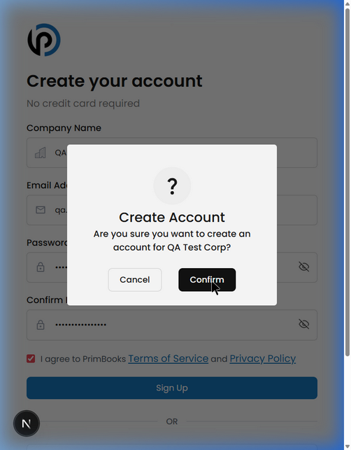

# PrimBooks — Smoke Test Report (Part 1 of 2)
## System Accessibility & Core Navigation

**Date:** March 23, 2026  
**Lead QA:** Azeez  
**Environment:** localhost:3000  
**Account:** gundro.nodes@gmail.com (Admin role)

---

## 1. Objective

Verify that PrimBooks is accessible, stable, and that all core modules load correctly. This is the first pass — confirming the application is ready for deeper functional testing.

---

## 2. Authentication

| Test | Result | Notes |
|------|--------|-------|
| **Sign Up** | ✅ Pass | Fields: Company Name, Email, Password, Confirm Password, Terms checkbox. Confirmation modal appears. |
| **Login** | ✅ Pass | Email + password login works. Redirects to `/dashboard`. |
| **Google OAuth** | ⬜ Not Tested | Button visible, not tested on localhost. |
| **Apple OAuth** | ⬜ Not Tested | Button visible, not tested on localhost. |
| **Forgot Password** | ⬜ Not Tested | Link visible, points to `/reset-password`. |

### Sign Up Flow
The sign up form includes Company Name, Email, Password, and Confirm Password. After submission, a confirmation modal appears before account creation — this is a nice UX touch.

**Result:** Authentication is stable and functional. ✅

---

## 3. Dashboard — First Impression

**URL:** `/dashboard` — ✅ Loaded

The dashboard displays:
- 4 KPI cards: Total Revenue, Total Expenses, Orders, Invoices
- Cash Flow chart (FY2026)
- Revenue Analysis bar chart
- Invoice summary section

**Result:** Dashboard loads correctly and displays all expected widgets. ✅

---

## 4. Module Navigation — All 12 Modules Accessible

Every sidebar module was clicked. **All loaded without errors.**

| # | Module | URL | Status | What's Inside |
|---|--------|-----|--------|---------------|
| 1 | **Dashboard** | `/dashboard` | ✅ | KPI cards, Cash Flow, Revenue Analysis |
| 2 | **Record** | `/record` | ✅ | Items table, Search, "Add records" button |
| 3 | **CRM** | `/crm/order` | ✅ | Order, Customers, Invoice, Quotation, Credit Note |
| 4 | **Production** | `/production` | ✅ | Raw materials table |
| 5 | **Purchase** | `/purchase/expenses` | ✅ | Expenses, Vendors |
| 6 | **Bank Reconciliation** | `/bank-reconciliation` | ✅ | Upload Statement, Reconcile, History |
| 7 | **Inventory** | `/inventory/inventorylist` | ✅ | Inventory List, Inventory Adjustment |
| 8 | **Finance** | `/finance/chart-of-account` | ✅ | Chart of Account, Journal, Banking, Tax |
| 9 | **Assets** | `/asset/list` | ✅ | List of Assets, Asset Categories |
| 10 | **Payroll Mgmt.** | `/hr-payroll/employees` | ✅ | Employees, Department, Payroll, Loans, Leave, Pension |
| 11 | **Reports** | `/reports/audit-trail` | ✅ | Audit Trail (empty — "No activity recorded") |
| 12 | **Settings** | `/settings` | ✅ | Profile, Notification, Organization, Currency, Team, Subscription |

---

## 5. Summary

| Area | Verdict |
|------|---------|
| **Authentication** | ✅ Stable — Sign up and Login both work |
| **Dashboard** | ✅ Loads correctly |
| **All 12 Modules** | ✅ Accessible and load without errors |
| **Overall System Status** | 🟢 **Application is stable and ready for functional testing** |

---

## 6. What's Next (Part 2)

In the next report, I will cover:
- Detailed Dashboard data analysis
- PRD vs. Implementation cross-reference
- Specific issues and bugs identified during the smoke test
- Recommendations for the development team

---

**Lead QA:** Azeez  
**Company:** Abvakon Mobile Solutions
