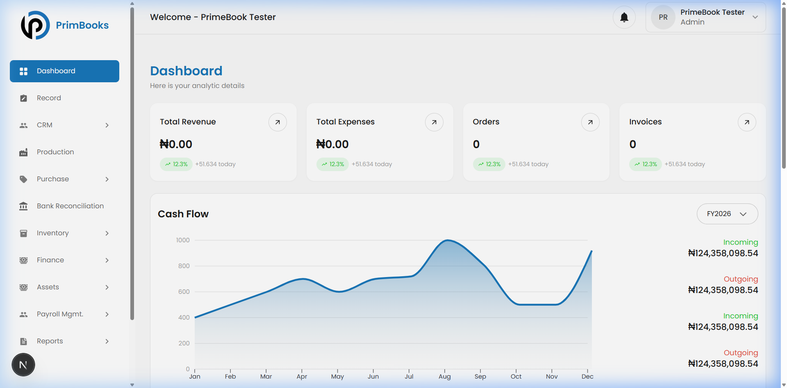
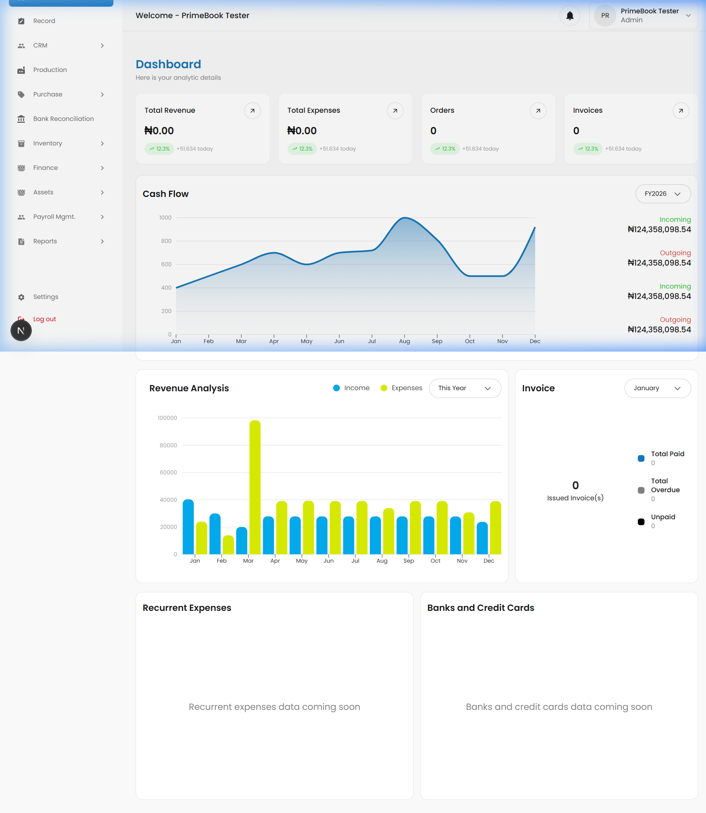
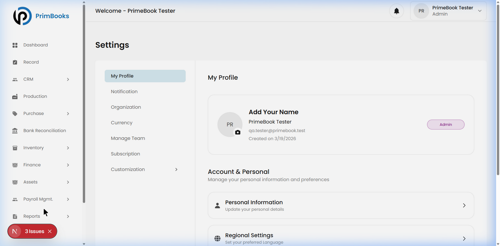

# PrimBooks — Smoke Test Report (Part 2 of 2)
## Dashboard Analysis, Issues & PRD Cross-Reference

**Date:** March 23, 2026  
**Lead QA:** Azeez  
**Environment:** localhost:3000  
**Account:** gundro.nodes@gmail.com (Admin role)

---

## 1. Objective

Following the accessibility verification in Part 1 (all 12 modules confirmed stable), this report covers the detailed findings: Dashboard data integrity, bugs identified, and a cross-reference against the PRD.

---

## 2. Dashboard — Detailed Analysis

### 🔴 Issue #1: Hardcoded KPI Data

The 4 KPI cards (Total Revenue, Total Expenses, Orders, Invoices) show correct values (₦0.00 / 0 for a fresh account). However, every card displays identical green text:

> **↗ 12.3%  +51.634 today**

This is impossible on an account with zero data. These are **hardcoded placeholder values** that were not connected to real calculations.

---

### 🔴 Issue #2: Cash Flow Chart Shows Fake Data

The Cash Flow chart displays a line graph with values peaking at ~₦1,000 in August, and shows:
- **Incoming: ₦124,358,098.54**
- **Outgoing: ₦124,358,098.54**

This is **₦124 Million** on a brand new account with zero transactions. This data is clearly placeholder/demo data.

---

### 🔴 Issue #3: Revenue Analysis Chart Also Shows Fake Data

The Revenue Analysis bar chart shows Income and Expense bars up to ₦100,000 per month — again, on an account with no transactions.

---

### ℹ️ Issue #4: "Coming Soon" Placeholders

Two sections at the bottom of the dashboard show:
- "Recurrent expenses data coming soon"
- "Banks and credit cards data coming soon"

Not a bug — these are honest "not yet built" indicators. Documented for status tracking.

---

## 3. Settings — Profile Issues

### 🟡 Issue #5: Company Name Not Saved to Profile

During sign up, "QA Test Corp" was entered as the Company Name. But the Settings page shows:
- **"Add Your Name"** ← Should display the company name
- **PrimBooks Tester** (appears to be a default name)

The company name from registration did not carry over to the profile.

---

### 🟡 Issue #6: "3 Issues" Badge

A small red badge reading "3 Issues" appeared in the bottom-left corner of the app during navigation. There is no explanation of what these issues are. This may be a developer debugging widget that was not removed.

---

## 4. PRD Cross-Reference

Comparing the sidebar modules against the Product Requirements Document:

| PRD Module | Sidebar Label | Status | Notes |
|------------|--------------|--------|-------|
| Dashboard | Dashboard | ✅ Present | Has placeholder data issues |
| Records | **Record** | ✅ Present | Label uses singular, PRD uses plural |
| CRM | CRM | ✅ Present | Full submenu works |
| Production | Production | ✅ Present | Functional |
| Purchases | **Purchase** | ✅ Present | Label uses singular, PRD uses plural |
| Finance | Finance | ✅ Present | Full submenu works |
| HR & Payroll | **Payroll Mgmt.** | ✅ Present | Different label from PRD |
| Inventory | Inventory | ✅ Present | PRD said "Not started" — now built! |
| Bank Reconciliation | Bank Reconciliation | ✅ Present | #1 selling point |
| Audit Trail | Under **Reports** | ✅ Present | Not standalone — sub-item of Reports |
| Reports | Reports | ✅ Present | Contains Audit Trail |
| Asset Management | **Assets** | ✅ Present | Shorter label than PRD |
| Settings | Settings | ✅ Present | Full submenu works |

**Key Observation:** All PRD modules are present. Some have minor label differences. Inventory was previously "Not started" per the PRD but is now built — a positive development progress indicator.

---

## 5. Issue Summary

| # | Issue | Severity | Module |
|---|-------|----------|--------|
| 1 | Dashboard KPIs show hardcoded "+51.634 today" and "12.3%" on empty account | **Medium** | Dashboard |
| 2 | Cash Flow chart shows ₦124M incoming/outgoing on new account | **Medium** | Dashboard |
| 3 | Revenue Analysis bar chart shows ₦100K values with no transactions | **Medium** | Dashboard |
| 4 | "Coming soon" placeholders for Recurrent Expenses and Banking | **Informational** | Dashboard |
| 5 | Company name from sign up not saved to user profile | **Low** | Settings |
| 6 | "3 Issues" red badge — unclear what it refers to | **Low** | Global |

---

## 6. Recommendations

1. **Dashboard Priority Fix:** Remove or connect the hardcoded KPI percentages and chart data to real calculations. This is the first thing users see.
2. **Profile Data Flow:** Ensure the Company Name entered during sign up carries over to the user profile/settings.
3. **Label Consistency:** Align sidebar labels with the PRD (Records vs Record, Purchases vs Purchase).
4. **Debug Widget:** Remove the "3 Issues" badge from production builds.

---

## 7. Next Steps

- **Phase 2:** Functional testing of CRUD operations across Records, CRM, and Finance modules.
- **Phase 3:** Role-based permission testing (Admin, Accountant, HR, Auditor).
- **Bug Registry:** File formal tickets for Issues #1 through #6.

---

**Lead QA:** Azeez  
**Company:** Abvakon Mobile Solutions
