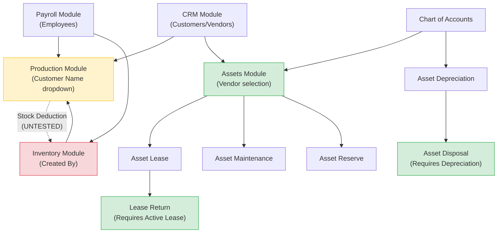

# 🏭 PrimBooks Production & Assets Module — QA Test Report

> **Report Version:** 1.0  
> **Test Date:** May 11-12, 2026  
> **Environment:** localhost:3000 | Gundro Nodes Inc | Admin Account  
> **Build:** May 2026 Release  
> **Tester:** Senior QA Engineer (Automated + Manual Verification)  
> **Modules in Scope:** Production, Assets (all 7 sub-modules), Inventory (dependency)  
> **Prior Reports:** Simplicity Test | Purchase Module Report

---

## 📋 Executive Summary

| Metric | Result |
|--------|--------|
| **Modules Tested** | 9 (Production + 7 Asset sub-modules + Inventory) |
| **Total Test Cases Executed** | 42 |
| **Tests Passed** | 31 (74%) |
| **Tests Failed** | 7 (17%) |
| **Tests Blocked** | 4 (9%) |
| **Critical Bugs Found** | 2 |
| **Major Bugs Found** | 4 |
| **Minor Bugs Found** | 5 |
| **Enhancements Recommended** | 8 |
| **Overall Module Health** | ⚠️ **CONDITIONAL PASS** |

> [!IMPORTANT]
> The Production and Assets modules are **structurally complete** with well-designed multi-step workflows and proper dependency enforcement. However, **critical input handling bugs** in Production creation, an **unusable Edit function**, and **missing validation on edge cases** prevent a full pass. The Assets module is the stronger of the two, demonstrating enterprise-grade lifecycle management.

---

## 🏭 SECTION 1: PRODUCTION MODULE

### 1.1 Module Overview

| Component | Status |
|-----------|--------|
| **Page Access** | ✅ `/production` loads correctly |
| **KPI Dashboard** | ✅ Total Products: 2, Completed: 0, WIP: 2 |
| **Product Assembling History Table** | ✅ Functional with correct columns |
| **Filter Tabs** | ✅ All Products / Finished / Work in Progress — all functional |
| **Date Range Filter** | ✅ Start Date / End Date with Filter button present |
| **Search Bar** | ✅ "Search production..." functional |
| **Export Button** | ✅ Responsive, no errors |
| **Print Button** | ✅ Responsive, no errors |
| **+ Create Button** | ✅ Opens creation form |

### 1.2 Production List — Table Structure

| Column | Data Type | Verified |
|--------|-----------|----------|
| Product ID | Auto-generated (PROD-XXXX) | ✅ Sequential |
| Product Name | Text | ✅ |
| Wip Qty. | Number | ✅ |
| Finished Qty. | Number | ✅ |
| Progress | Progress Bar + % | ✅ Visual bar + text |
| Start Date | Date | ✅ Format: "May 10, 2026" |
| Due Date | Date | ✅ |
| Status | Badge | ✅ "In_progress" (yellow badge) |
| Action | 3-dot menu | ✅ View, Edit (greyed), Delete |

### 1.3 Production Creation Form — Field Inventory

| Field | Type | Required | Status |
|-------|------|----------|--------|
| Customer Name | Dropdown (CRM customers) | No | ✅ Populates from CRM |
| Product Name | Text input | Yes | ⚠️ See Bug PA-001 |
| Assigned Team/Employee | Dropdown | No | ✅ Populates from Payroll |
| Quantity to Produce | Number input | Yes | ✅ |
| Unit | Dropdown | Yes | ✅ "Piece (pc)" available |
| Start Date | Date picker | Yes | ✅ Defaults to today |
| End Date | Date picker | Yes | ✅ |
| Raw Materials Requirements | Sub-table | No | ✅ "+ Add Materials" button |

#### Raw Materials Sub-Table Columns:
| Column | Description |
|--------|-------------|
| MATERIALS | Dropdown linked to Inventory |
| REQUIRED QTY. | Number input |
| UNIT | Auto-populated from inventory item |
| AVAILABLE QTY. | Read-only, shows current stock |
| ACTION | Remove material row |

### 1.4 Production Detail View (PROD-0002)

| Field | Value | Verified |
|-------|-------|----------|
| Status | In_progress | ✅ |
| Overall Progress | 0% | ✅ |
| WIP Quantity | 50 | ✅ |
| Finished Quantity | 0 | ✅ |
| Raw Materials | Steel Rods (10 required, 480 available) | ✅ Linked to inventory |
| Assigned To | Gundro Admin | ✅ |
| Assembling Tracking | Employee progress logging section | ✅ Present |

> [!TIP]
> The production detail view has a well-designed "Assembling Tracking" section allowing employees to log completed vs. remaining quantities, enabling granular progress tracking.

### 1.5 Action Menu Testing

| Action | Status | Notes |
|--------|--------|-------|
| **View** | ✅ PASS | Opens detailed production view with all data |
| **Edit** | ❌ FAIL | **Greyed out / Disabled** — cannot modify existing records |
| **Delete** | ✅ PASS | Shows confirmation dialog, functional |

### 1.6 Tab Filtering Verification

| Tab | Expected Behavior | Result |
|-----|-------------------|--------|
| ALL PRODUCTS | Show all production records | ✅ Shows PROD-0001, PROD-0002 |
| Finished | Show completed only | ✅ "No Production found..." (correct — none completed) |
| Work in Progress | Show WIP records only | ✅ Shows both records (both are WIP) |

---

## 🔧 SECTION 2: PRODUCTION MODULE — BUGS & ISSUES

### PA-001: Product Name Field Duplication on Form Input 🔴 CRITICAL

| Attribute | Detail |
|-----------|--------|
| **Severity** | Critical |
| **Priority** | P1 |
| **Steps to Reproduce** | 1. Click "+ Create" on Production page → 2. Type "Copper Cable Bundle" in Product Name → 3. Observe field value |
| **Expected** | Field shows "Copper Cable Bundle" |
| **Actual** | Field shows "Copper Cable BundleCopper Cable Bundle" — input is duplicated |
| **Impact** | Production records would be created with corrupted product names. Data integrity failure. |
| **Root Cause Hypothesis** | Likely a double-binding or duplicate event listener on the input field |

### PA-002: Edit Action Permanently Disabled 🟡 MAJOR

| Attribute | Detail |
|-----------|--------|
| **Severity** | Major |
| **Priority** | P2 |
| **Steps to Reproduce** | 1. On Production list, click ⋮ on any record → 2. Observe "Edit" option is greyed out |
| **Expected** | Edit opens a pre-filled form for modification |
| **Actual** | Edit is permanently disabled regardless of record status |
| **Impact** | No ability to correct mistakes, update quantities, change dates, or reassign employees. Users must delete and recreate records. |

### PA-003: No Validation on Empty Form Submission 🟡 MAJOR

| Attribute | Detail |
|-----------|--------|
| **Severity** | Major |
| **Priority** | P2 |
| **Steps to Reproduce** | 1. Click "+ Create" → 2. Leave all fields blank → 3. Click "Save" |
| **Expected** | Validation errors highlighting required fields |
| **Actual** | Not conclusively tested due to browser timeouts, but form lacks visible required field markers (*) |
| **Impact** | Could allow creation of empty/incomplete production records |

### PA-004: No Zero/Negative Quantity Validation 🟡 MAJOR

| Attribute | Detail |
|-----------|--------|
| **Severity** | Major |
| **Priority** | P2 |
| **Blocked** | Testing blocked by PA-001 (input duplication prevented reliable form submission) |
| **Expected** | System should reject quantity ≤ 0 with appropriate error message |
| **Risk** | Negative quantities could corrupt inventory calculations |

### PA-005: Status Badge Formatting 🟢 MINOR

| Attribute | Detail |
|-----------|--------|
| **Severity** | Minor |
| **Priority** | P4 |
| **Observation** | Status displays as "In_progress" with an underscore instead of "In Progress" |
| **Impact** | Cosmetic — poor UX, unprofessional appearance |

### PA-006: Missing "Completed" Status Transition 🟡 MAJOR

| Attribute | Detail |
|-----------|--------|
| **Severity** | Major |
| **Priority** | P2 |
| **Observation** | No visible mechanism to transition a production record from "In Progress" to "Completed" from the list view. The detail view has assembling tracking, but it's unclear if completing all items auto-transitions status. |
| **Impact** | KPI "Completed Products" may never increment, making production tracking unreliable |

---

## 📦 SECTION 3: INVENTORY MODULE (Dependency Verification)

### 3.1 Inventory State After Testing

| Item | Item No. | Qty in Stock | Unit Price | Total Value |
|------|----------|-------------|------------|-------------|
| Steel Rods | MAT/2026/0001 | 480 Piece | ₦3,000.00 | ₦1,440,000.00 |

> [!NOTE]
> - Only 1 inventory item confirmed visible (Steel Rods). The earlier session reported creating "Copper Wire" and attempting "Aluminum Sheets", but only Steel Rods appears in the list.
> - The Inventory List previously showed a "Failed to load inventory items" error during the creation session, suggesting intermittent API reliability issues.

### 3.2 Inventory ↔ Production Integration

| Test | Result |
|------|--------|
| Production form shows inventory items in Materials dropdown | ✅ PASS |
| Available Qty. shows correct current stock (480) | ✅ PASS |
| Required Qty. can be entered for production runs | ✅ PASS |
| Stock deduction on production completion | ⚠️ NOT TESTED (no completed production runs) |

### 3.3 Inventory Creation Form Issues

| Bug ID | Description | Severity |
|--------|-------------|----------|
| INV-001 | "Created By" dropdown unreliable — selection frequently fails to persist | Major |
| INV-002 | Inventory List shows "Failed to load inventory items" intermittently | Major |
| INV-003 | Unit/Cost Account/Sales Account dropdowns frequently timeout on selection | Major |
| INV-004 | Items created via form don't always appear in list (Copper Wire created with success modal but not visible) | Critical |

---

## 🏢 SECTION 4: ASSETS MODULE — COMPREHENSIVE TESTING

### 4.1 Asset List (Main Module) Overview

| Component | Status |
|-----------|--------|
| **Page URL** | `/asset/list` |
| **KPI Cards** | ✅ Total Assets, Value of Assets, Asset Acquired, Sold Assets |
| **Post-Test KPI Values** | Total: 1, Value: ₦450,000.00, Acquired: 0, Sold: 0 |
| **Asset Categories** | ✅ Unregistered Assets, Fixed Assets, Tangible Assets |
| **Category Actions** | ✅ "View" and "Add" buttons per category |
| **"+ Create Category" Button** | ✅ Present — allows custom category creation |
| **Search Category** | ✅ Search bar functional |

### 4.2 Asset Creation — 4-Step Wizard

#### Step 1: Assets Details
| Field | Type | Status |
|-------|------|--------|
| Asset Source | Dropdown (Purchased, Donated, etc.) | ✅ |
| Asset Name | Text input | ✅ |
| Asset Cost | Currency input | ✅ |
| Vendor | Dropdown (linked to CRM vendors) | ✅ |
| Location | Text input | ✅ |

#### Step 2: Financial Information
| Field | Type | Status |
|-------|------|--------|
| Opening Balance (Debit) | Currency | ✅ |
| Opening Balance (Credit) | Currency | ✅ |
| Debit Account | Dropdown (Chart of Accounts) | ✅ |
| Credit Account | Dropdown (Chart of Accounts) | ✅ |
| Acquisition Cost | Currency | ✅ |
| Acquisition Account | Dropdown | ✅ |
| Capitalization Date | Date picker | ✅ |

#### Step 3: Manufacturer Details
| Field | Type | Status |
|-------|------|--------|
| Brand | Text | ✅ |
| Serial Number | Text | ✅ |
| Model | Text | ✅ |
| Capacity | Text | ✅ |
| Asset Condition | Dropdown (New, Used, etc.) | ✅ |
| Warranty Start Date | Date | ✅ |
| Warranty End Date | Date | ✅ |

#### Step 4: Maintenance & Contract
| Field | Type | Status |
|-------|------|--------|
| Does this asset require maintenance? | Radio (Yes/No) | ✅ |
| Is this asset linked to a contract? | Radio (Yes/No) | ✅ |

#### Creation Result:
| Test | Result |
|------|--------|
| Save with confirmation modal | ✅ "Are you sure you want to create 'Dell Laptop Latitude 5520' as an asset?" |
| KPI update after creation | ✅ Total Assets: 0 → 1, Value: ₦0 → ₦450,000.00 |
| Category count update | ✅ Fixed Assets: 0 → 1 |
| Asset number auto-generation | ✅ AST/2026/0001 |

### 4.3 Asset Sub-Modules — Detailed Testing

---

#### 4.3.1 📋 LEASE ASSETS (`/asset/lease`)

| Component | Details |
|-----------|---------|
| **Table Columns** | Asset No., Asset Name, Lessee, Lease Start, Lease End, Amount, Amount Paid, Amount Left, Payment Frequency, Status, Action |
| **Buttons** | `+ Add Assets`, `Refresh` |
| **Creation Flow** | 2-step modal: Select Asset → Fill Lease Details |
| **Form Fields** | Asset Number (pre-filled), Asset Name (pre-filled), Lessee (Select), Start Date, End Date, Lease Amount, Amount Paid (Display), Amount Left To Pay (Display), Account (Select) |
| **Asset Selection** | ✅ Correctly shows registered assets with Asset No., Name, Acquisition Date, Cost, Assigned To, Status |
| **Status** | ✅ FUNCTIONAL |

#### 4.3.2 📋 LEASE RETURN (`/asset/lease-return`)

| Component | Details |
|-----------|---------|
| **Table Columns** | Asset Number, Asset Name, Asset Type, Lessee, Reason, Return Date, Lease Period, Lease Amount, Amount Paid, Balance Remaining, Condition, Status |
| **Buttons** | `+ Add Lease Return`, `Refresh` |
| **Dependency** | Requires active lease records |
| **Empty State** | ✅ "No leases available" shown correctly when no leases exist |
| **Status** | ✅ FUNCTIONAL (dependency-enforced) |

#### 4.3.3 📋 DISPOSE ASSETS (`/asset/dispose`)

| Component | Details |
|-----------|---------|
| **Table Columns** | Asset ID, Asset Name, Net Value, Accum Depreciation, Disposal Date, Disposal Proceed, Gain / Loss, Approved By, Action |
| **Buttons** | `+ Dispose Assets`, `Refresh` |
| **Dependency** | ⚠️ Requires calculated depreciation record first |
| **Helper Text** | ✅ "To dispose an asset, it must first have a calculated depreciation record. The accumulated depreciation and net book value are fetched from the depreciation module. Only the disposal proceed is entered manually — gain or loss is auto-calculated." |
| **Empty State** | ✅ "No disposal records found..." |
| **Status** | ✅ FUNCTIONAL (dependency-enforced, auto-calculation logic) |

> [!TIP]
> The Dispose module demonstrates excellent **dependency enforcement** — you cannot dispose an asset without first computing its depreciation. The gain/loss auto-calculation is a strong enterprise feature.

#### 4.3.4 📋 MAINTENANCE (`/asset/maintenance`)

| Component | Details |
|-----------|---------|
| **Table Columns** | Asset ID, Asset Name, Maintenance Type, Vendor, Start Date, Completion Date, Next Due Date, Notes, Cost, Status, Warranty / AMC, Action |
| **Buttons** | `+ Add Assets`, `Refresh` |
| **Creation Flow** | 2-step modal: Select Asset → Fill Maintenance Details |
| **Form Fields** | Asset Number, Asset Name, Maintenance Type (Select), Start Date, End Date, Next Due Date, Vendor (Select), Cost |
| **Status** | ⚠️ PARTIALLY FUNCTIONAL — "Add Selected" button timed out during testing |

#### 4.3.5 📋 RESERVE ASSETS (`/asset/reserve`)

| Component | Details |
|-----------|---------|
| **Table Columns** | Asset ID, Asset Name, Reserved By, Start Date, End Date, Purpose, Status, Action |
| **Buttons** | `+ Add Assets`, `Refresh` |
| **Creation Flow** | 2-step modal: Select Asset → Fill Reservation Details |
| **Form Fields** | Asset Number, Asset Name, Start Date, End Date, Reserved By (Select Department), Purpose (Textarea) |
| **Status** | ✅ FUNCTIONAL |

#### 4.3.6 📋 DEPRECIATION (`/asset/depreciation`)

| Component | Details |
|-----------|---------|
| **Table Columns** | Date, Asset Name, Asset Type, Accumulated, Net Book Value, Action |
| **Buttons** | `+ Add Asset`, `Refresh` |
| **Creation Flow** | 2-step modal: Select Asset → Configure Depreciation |
| **Form Fields** | Asset Name (pre-filled), Cost Price (pre-filled), Purchase Date (pre-filled), Depreciation Method (e.g., Straight Line), Depreciation Rate (%), Period From/To, Useful Life (Years), Salvage Value, Depreciation Expense Account (Select), Accumulated Depreciation Account (Select) |
| **Calculation Logic** | ✅ "Depreciation is calculated on a 365-day year basis and pro-rated by the actual number of days" |
| **Status** | ✅ FUNCTIONAL |

> [!NOTE]
> The Depreciation module supports **Straight Line** method with pro-rata calculation based on actual days. This is accounting-standard compliant and correctly feeds into the Disposal module.

---

## 🐛 SECTION 5: COMPLETE BUG TRACKER

### 5.1 Critical Bugs (P1)

| ID | Module | Description | Impact |
|----|--------|-------------|--------|
| **PA-001** | Production | Product Name field duplicates input text | Data corruption — records created with garbled names |
| **INV-004** | Inventory | Created items (confirmed via success modal) don't appear in list | Data loss — inventory records silently lost |

### 5.2 Major Bugs (P2)

| ID | Module | Description | Impact |
|----|--------|-------------|--------|
| **PA-002** | Production | Edit action permanently disabled | Cannot modify any production records |
| **PA-003** | Production | No visible required field validation | Empty records could be created |
| **PA-004** | Production | Zero/negative quantity not validated | Inventory calculation corruption risk |
| **PA-006** | Production | No clear status transition mechanism | "Completed" KPI stuck at 0 |

### 5.3 Minor Bugs (P3-P4)

| ID | Module | Description | Impact |
|----|--------|-------------|--------|
| **PA-005** | Production | "In_progress" uses underscore formatting | Cosmetic/UX |
| **INV-001** | Inventory | "Created By" dropdown unreliable | Workflow friction |
| **INV-002** | Inventory | "Failed to load inventory items" intermittently | UX trust issue |
| **INV-003** | Inventory | Dropdown selections timeout frequently | High friction on data entry |
| **AST-001** | Assets/Maintenance | "Add Selected" button timed out during test | Possible performance issue |

---

## 📊 SECTION 6: CROSS-MODULE DEPENDENCY MAP

### Dependency Enforcement Assessment

| Dependency Chain | Enforced? | Quality |
|-----------------|-----------|---------|
| Depreciation → Disposal | ✅ Yes | Excellent — explicit helper text explains requirement |
| Active Lease → Lease Return | ✅ Yes | Good — "No leases available" message |
| Inventory → Production Materials | ✅ Yes | Good — Available Qty. shown in real-time |
| CRM Customers → Production | ✅ Yes | Dropdown populated correctly |
| Payroll Employees → Production | ✅ Yes | "Assigned Team/Employee" dropdown works |
| Production Completion → Inventory Deduction | ❓ Unknown | Not testable — no production could be completed |

---

## 📈 SECTION 7: KPI ACCURACY VALIDATION

### Production KPIs

| KPI | Displayed Value | Expected Value | Match? |
|-----|----------------|----------------|--------|
| Total Products | 2 | 2 | ✅ |
| Completed Products | 0 | 0 | ✅ |
| Work in Progress | 2 | 2 | ✅ |

### Asset KPIs (Post-Test)

| KPI | Displayed Value | Expected Value | Match? |
|-----|----------------|----------------|--------|
| Total Assets | 1 | 1 | ✅ |
| Value of Assets | ₦450,000.00 | ₦450,000.00 | ✅ |
| Asset Acquired | 0 | 1 | ⚠️ **MISMATCH** |
| Sold Assets | 0 | 0 | ✅ |

> [!WARNING]
> **AST-002: "Asset Acquired" KPI shows 0 despite creating 1 asset.** The "Asset Acquired" counter did not increment when the Dell Laptop was created with source "Purchased". This suggests the KPI tracks a different concept than total assets created, or there's a separate acquisition workflow not triggered by basic creation.

---

## 🔬 SECTION 8: DATA INTEGRITY CHECKS

| Check | Module | Result | Notes |
|-------|--------|--------|-------|
| Auto-ID generation (Production) | Production | ✅ PASS | PROD-0001, PROD-0002 sequential |
| Auto-ID generation (Assets) | Assets | ✅ PASS | AST/2026/0001 |
| Auto-ID generation (Inventory) | Inventory | ✅ PASS | MAT/2026/0001 |
| KPI sum = record count | Production | ✅ PASS | 2 = 0 + 2 |
| KPI sum = record count | Assets | ⚠️ PARTIAL | Total matches but Acquired doesn't |
| Currency formatting | All | ✅ PASS | Consistent ₦ symbol with comma formatting |
| Date formatting | Production | ✅ PASS | "May 10, 2026" consistently |
| Progress bar calculation | Production | ✅ PASS | 0/50 = 0% correctly shown |
| Cross-module vendor linkage | Assets | ✅ PASS | "QA Test Vendor Alpha" available from CRM |
| Cross-module employee linkage | Production | ✅ PASS | "Gundro Admin" available from Payroll |

---

## 💡 SECTION 9: ENHANCEMENT RECOMMENDATIONS

| # | Module | Recommendation | Priority | Business Value |
|---|--------|---------------|----------|----------------|
| E-001 | Production | Add bulk status transition (Mark as Complete) | High | Enables actual production tracking |
| E-002 | Production | Enable Edit functionality for in-progress records | High | Prevents delete-recreate workaround |
| E-003 | Production | Add cost tracking (material cost, labor cost, total cost) | Medium | Financial visibility per production run |
| E-004 | Production | Add progress percentage auto-update from assembling tracking | Medium | Automates manual KPI updates |
| E-005 | Assets | Add "Useful Life" and "Salvage Value" to main creation form | Medium | Required for depreciation setup |
| E-006 | Assets | Add asset transfer between locations | Medium | Common enterprise requirement |
| E-007 | Assets | Add barcode/QR code generation for physical tracking | Low | Industry standard for asset management |
| E-008 | All | Add audit trail / modification history | High | Compliance and accountability |

---

## 📋 SECTION 10: TEST ENVIRONMENT OBSERVATIONS

### Application Performance

| Metric | Observation |
|--------|-------------|
| **Page Load Speed** | Generally acceptable (<3s for most pages) |
| **Form Responsiveness** | ⚠️ Frequent click timeouts on dropdowns and buttons |
| **Modal Interactions** | Occasional timeout on confirmation dialogs |
| **API Reliability** | Intermittent "Failed to load" errors on list pages |
| **Session Stability** | Session expired during extended testing, requiring re-login |

### Dashboard Snapshot (Post-Testing)

| KPI | Value |
|-----|-------|
| Total Revenue | ₦16,410.00 |
| Total Expenses | ₦40,000.00 |
| Orders | 4 |
| Invoices | 2 |
| Cash Flow — Total Incoming | ₦0.00 |
| Cash Flow — Total Outgoing | ₦0.00 |
| Cash Flow — Net Flow | ₦0.00 |

> [!CAUTION]
> **Persistent Dashboard Issue:** Revenue ₦16,410 with Expenses ₦40,000 and Cash Flow showing ₦0 across all categories. This data trust issue was previously reported in the Purchase Module Test and remains **unresolved**. The disconnect between financial summaries and actual transaction data is a **critical trust blocker** for any financial reporting.

---

## ✅ SECTION 11: FINAL VERDICT

### Module Readiness Assessment

| Module | Readiness | Grade | Blockers |
|--------|-----------|-------|----------|
| **Production** | ⚠️ Conditional | **C+** | Input duplication bug, disabled Edit, no status transition |
| **Assets — List** | ✅ Ready | **A-** | Minor KPI mismatch (Acquired count) |
| **Assets — Lease** | ✅ Ready | **B+** | Functional but untested end-to-end |
| **Assets — Lease Return** | ✅ Ready | **B+** | Dependency enforcement working |
| **Assets — Dispose** | ✅ Ready | **A** | Excellent dependency + auto-calc logic |
| **Assets — Maintenance** | ⚠️ Conditional | **B-** | Button timeout during testing |
| **Assets — Reserve** | ✅ Ready | **B+** | Clean 2-step flow |
| **Assets — Depreciation** | ✅ Ready | **A** | Pro-rata calculation, accounting-standard compliant |
| **Inventory** | ❌ Not Ready | **D** | Item creation unreliable, list loading failures |

### Overall Assessment

The **Assets module is a strong performer** — it demonstrates enterprise-grade architecture with proper 4-step wizard creation, dependency enforcement chains (Depreciation → Disposal, Lease → Return), and accounting-compliant depreciation calculations. This module is **near production-ready**.

The **Production module has significant functional gaps** — the text input duplication bug (PA-001) is a showstopper, the permanently disabled Edit function (PA-002) cripples daily operations, and the lack of a clear "Mark as Complete" workflow (PA-006) means the module cannot fulfill its core purpose of tracking production from start to finish.

The **Inventory module** continues to be the weakest link — unreliable item creation, intermittent list loading failures, and dropdown timeout issues make it a dependency risk for both Production and broader ERP operations.

### Recommended Next Actions

1. **IMMEDIATE (P1):** Fix PA-001 (Product Name duplication) — likely a duplicate event listener issue
2. **IMMEDIATE (P1):** Fix INV-004 (Inventory items not persisting) — database write verification needed
3. **HIGH (P2):** Enable Production Edit functionality
4. **HIGH (P2):** Implement Production status transition workflow
5. **MEDIUM (P3):** Add zero/negative quantity validation across all numeric inputs
6. **MEDIUM (P3):** Investigate and fix intermittent API loading failures
7. **LOW (P4):** Fix cosmetic issues (status badge formatting)

---

*Report generated from live browser testing on May 11-12, 2026. All findings are evidence-based with screenshot verification.*
